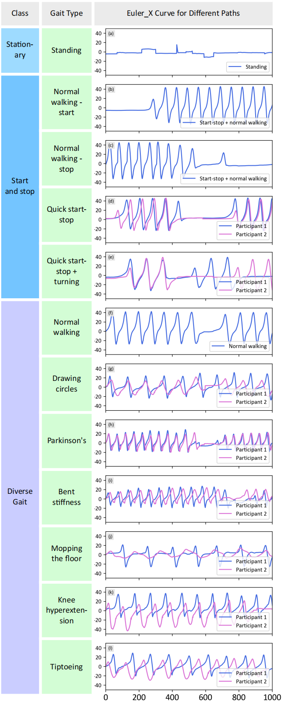
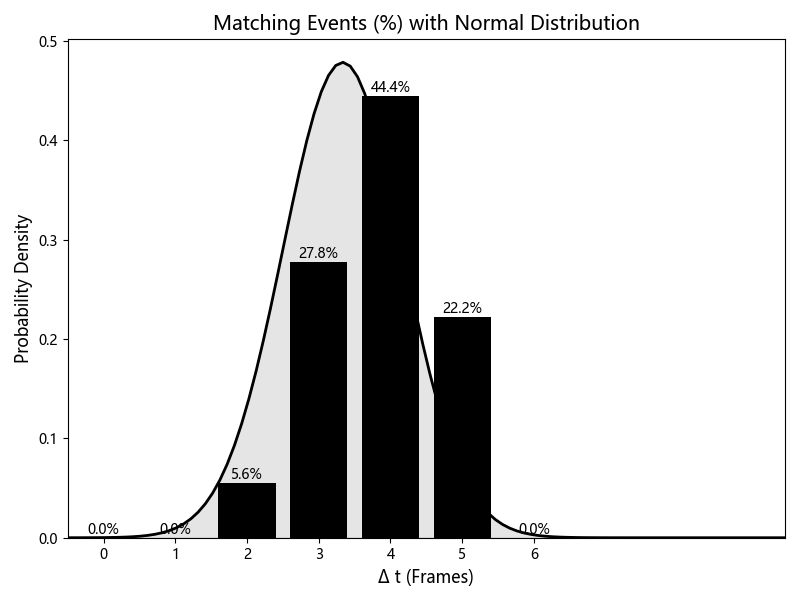
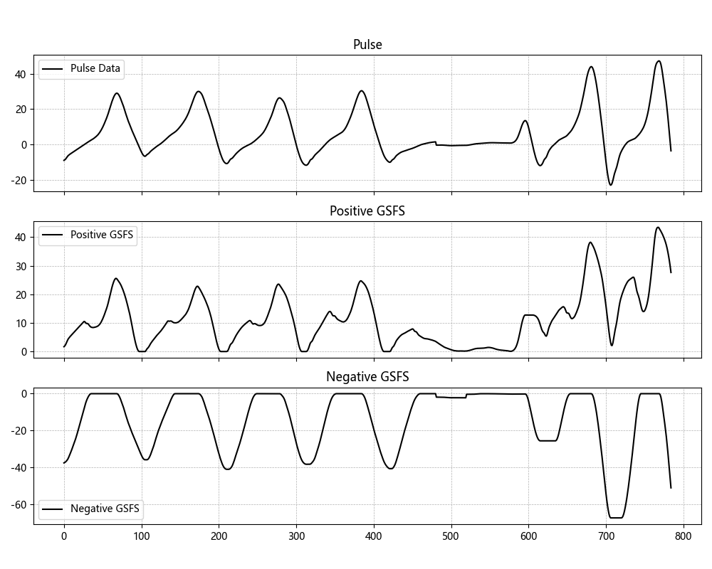
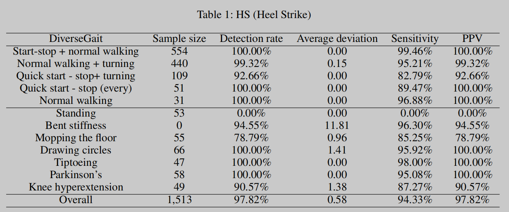
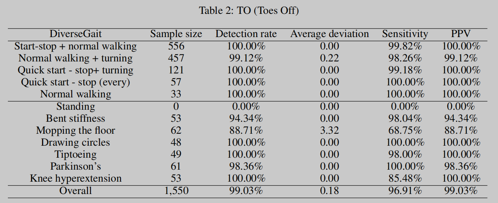

# README for Gait Event Detection Project

## Overview
This project implements the Gait Feature Slope Focuser (GFSF) algorithm, a state-of-the-art approach for real-time gait event detection in exoskeleton robots. The methodology, detailed in "Real-time Gait Event Detection and Adaptive Algorithm Rule Design for Exoskeleton Robots," focuses on the precise identification of gait events using IMU data, employing sophisticated techniques like sliding window and first-order difference functions. This innovative approach is tailored to adapt to various gait patterns, ensuring high accuracy and reliability in robotic control.

## Key Features
- **Gait Event Detection**: Offers real-time, precise detection of key gait events.
- **Data Processing**: Employs advanced data processing techniques for enhanced accuracy.
- **Algorithmic Adaptability**: Uniquely adapts to a wide range of gait patterns, ensuring versatility in application.

## Dependencies
- **Python 3**
- **Libraries**: `numpy`, `pandas`, `matplotlib`, `scipy`
- **Additional Modules**: `GFSF_60hz_dynamic`, `matchNcompare`

## Usage
Run `Main.py` to activate the application, seamlessly integrating modules for data processing, event detection, evaluation, and visualization.

## Modules Overview
- `data_processing.py`: Manages sophisticated data manipulation and analysis.
- `event_detection.py`: The heart of the project, dedicated to gait event detection.
- `evaluation.py`: Evaluates and validates the detection accuracy.
- `visualization.py`: Creates visual representations of data and results for intuitive understanding.

## Research Background

**Figure 1**: Diverse gait patterns. Highlights the complexity and variability of human walking styles, emphasizing the need for adaptable detection algorithms like GFSF.

The GFSF methodology, as illustrated in "Real-time Gait Event Detection and Adaptive Algorithm Rule Design for Exoskeleton Robots," revolutionizes gait event detection in robotics. It achieves remarkable accuracy in detecting events such as Heel Strike (HS), Toe Off (TO), Walking Start (WS), and Walking Pause (WP). The algorithm employs a combination of sliding window, first-order difference functions, and weighted sleep time methods to adaptively process gait signal data. This results in an unprecedented accuracy of 97.82% for HS events and 99.03% for TO events.

  
**Figure 2**: Error analysis. This graph demonstrates the precision and reliability of GFSF in detecting gait events, showcasing its minimal error margins.

The adaptability of GFSF to diverse and fluctuating gait patterns makes it a groundbreaking tool for exoskeleton robots. This adaptability is achieved through innovative adaptive threshold decision rules and real-time modulation of detection thresholds, allowing the algorithm to cater to individual gait patterns and environmental dynamics.

  
**Figure 3**: GFSF Schematic. This diagram provides a visual representation of the GFSF algorithm, elucidating its components and operational flow.

For a comprehensive understanding of the GFSF methodology and its impact in robotics, the full paper "Real-time Gait Event Detection and Adaptive Algorithm Rule Design for Exoskeleton Robots" is a must-read.

  
  
**Figures 4 & 5**: GFSF Results. These tables present the detailed outcomes of the GFSF algorithm, highlighting its high success rate in detecting key gait events.

## License
This project is licensed under the MIT License.

## Contact
- Liu Xing: [liuxing21@mails.tsinghua.edu.cn](mailto:liuxing21@mails.tsinghua.edu.cn)
- Liu Yifan: [yf-liu22@mails.tsinghua.edu.cn](mailto:yf-liu22@mails.tsinghua.edu.cn)

## Repository
[GitHub Repository](https://github.com/XingLiu1/Gait-Feature-Slope-Focuser)
